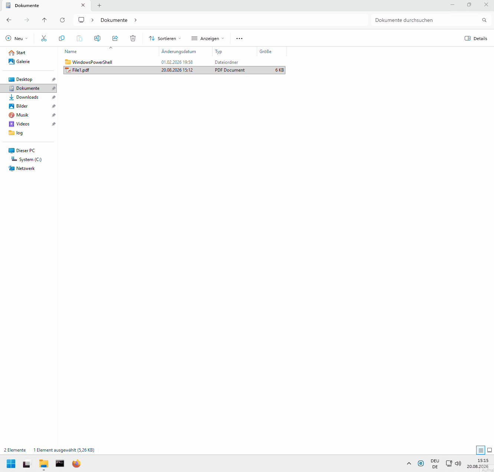

# NextcloudShare 2.0.1

NextcloudShare adds **Share via Nextcloud** and **Share via Nextcloud (options)** to Windows Explorer. It uploads local files when required, creates internal or public links, copies the result to the clipboard, and can create object subscriptions through the separate Nextcloud app **Abonnieren**.

## Demo



## Requirements

- Windows 10 or 11 with Windows PowerShell 5.1
- Nextcloud 34 with WebDAV, OCS Share API and Login Flow v2
- HTTPS, except for explicit localhost development
- Optional: Abonnieren 1.0.0 for email notifications

The Nextcloud desktop client is optional. If it is installed, NextcloudShare detects a matching sync folder. Files outside that folder are uploaded directly through WebDAV.

## Central configuration

Copy `NextcloudShare.config.example.json`, adjust it, and install with:

```powershell
powershell.exe -NoProfile -NonInteractive -ExecutionPolicy Bypass -File "Install.ps1" -ConfigurationPath "\\server\software\NextcloudShare.config.json"
```

The active administrator configuration is stored at:

```text
%ProgramData%\NextcloudShare\NextcloudShare.config.json
```

It contains no credentials. User identity, DPAPI-protected app password and detected local sync folder are stored separately at:

```text
%LOCALAPPDATA%\NextcloudShare\user.json
```

Important administrator settings:

| Setting | Purpose |
|---|---|
| `ServerUrl` | Nextcloud base URL |
| `RemoteUploadFolder` | Root folder for direct uploads |
| `RemoteSyncRoot` | Server counterpart of the local sync root |
| `SubscriptionsEnabled` | Enables integration with Abonnieren |
| `Defaults` | Default link type and expiry |
| `UserOverrides` | Controls which values users may change |
| `Migration` | Optional neutral migration settings for an earlier deployment |

`LegacyUserDataSubpath` and `LegacyShellKeys` are intentionally empty in the public example. An organization can fill them in its private deployment configuration without embedding internal names in the source code.

## Installation locations

- Program files: `%ProgramFiles%\NextcloudShare`
- Central configuration and installation log: `%ProgramData%\NextcloudShare`
- User configuration and runtime log: `%LOCALAPPDATA%\NextcloudShare`
- Product registry key: `HKLM\Software\NextcloudShare`

The installer is suitable for computer-wide deployment as Administrator or `SYSTEM`. Add `-Force` for a repair installation and `-Diagnostic` for console output.

## Sharing and notifications

The quick command uses the configured defaults. The options dialog supports:

- public or internal link;
- read, edit, create and delete permissions as applicable;
- expiry and optional password;
- notifications for download, upload, modification and deletion.

Notification choices are available only for public links and when `SubscriptionsEnabled` is true. NextcloudShare sends the numeric share ID and event mask to Abonnieren. The app validates ownership, resolves the shared object and creates or updates the single object-wide subscription. If this fails, NextcloudShare removes the newly created public link so no partial result remains.

Event mask: upload `1`, modification `2`, deletion `4`, download `8`.

## Security

- Authentication uses Nextcloud Login Flow v2.
- App passwords are protected with Windows DPAPI for the current user.
- Production servers must use HTTPS.
- Credentials, passwords and generated share links are never written to logs.
- The example configuration contains no production endpoint or secret.

## Uninstall

```powershell
powershell.exe -NoProfile -NonInteractive -ExecutionPolicy Bypass -File "C:\Program Files\NextcloudShare\Uninstall-NextcloudShare.ps1"
```

Uninstall removes `%ProgramFiles%\NextcloudShare` and `%ProgramData%\NextcloudShare`.
When run interactively, it asks whether to delete `%LOCALAPPDATA%\NextcloudShare`
from every user profile (credentials and logs). The default is to keep that data
so a later reinstall can reuse it. For a silent uninstall that also removes user
data:

```powershell
powershell.exe -NoProfile -NonInteractive -ExecutionPolicy Bypass -File "C:\Program Files\NextcloudShare\Uninstall-NextcloudShare.ps1" -RemoveUserData
```

## License

AGPL-3.0-or-later
